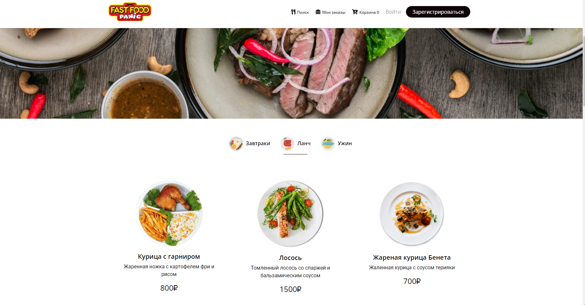

### Overview
The application is a full-fledged online store for a restaurant with a basket and payment for goods.
Products are edited, deleted and added through the Sanity system, which is already included in this project. Payment is made through the Yukassa financial system. To pay, you need to connect to the microservice, which is located at:
https://yookassa-payment.herokuapp.com
The delivery module is not currently operational and requires further development. Instead of a real delivery system, there is a stub.

DEMO: https://eat-front.herokuapp.com/

### Note
The application was developed during the thesis and requires refactoring. At the moment, having more extensive practical experience in the development of commercial applications, I would rewrite it differently.
### Assembly

The application has two components:
1. Front - current application
2. Back for the store is implemented on the Sanity system
   The configuration schema for the backend is located in the moccasin-crow-back folder.
3. Microservice for payment. Already running on the server and does not require a connection.
4. Connecting to firebase databases.

## Developer
### Run locally
- Run `npm install` in the project directory

- Run via `npm run dev`

## Portal entry

- local: http://localhost:3000